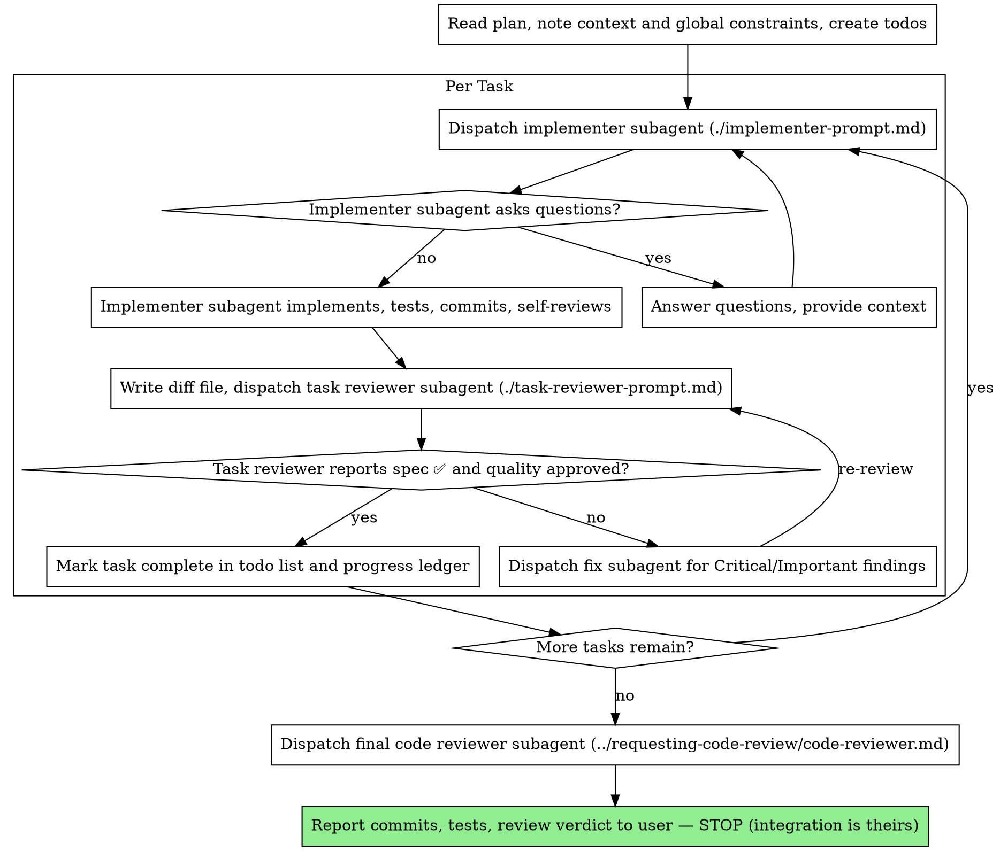

# Subagent-Driven Development

Execute a plan by dispatching a fresh implementer subagent per task, a task review (spec compliance + code quality) after each, and a broad whole-branch review at the end.

**Why subagents:** each gets isolated context you construct — its task and nothing else. They never inherit your session's history; that keeps them focused and keeps your own context free for coordination.

**Core principle:** Fresh subagent per task + task review + broad final review = high quality, fast iteration.

**Continuous execution:** do not pause between tasks to check in with your human partner. The only reasons to stop: a BLOCKED status you cannot resolve, ambiguity that genuinely prevents progress, or all tasks complete. Narrate at most one short line between tool calls — the ledger and tool results carry the record.

## When to Use

- Written plan with mostly independent tasks, executing in this session → this skill
- Executing in a separate/parallel session → workflow:executing-plans
- No plan yet, or tasks tightly coupled → brainstorm/plan first, or execute manually

## The Process

## Pre-Flight Plan Review

Before dispatching Task 1, scan the plan once for tasks that contradict each other or the Global Constraints, and for anything the plan explicitly mandates that the review rubric treats as a defect. Present everything you find to your human partner as one batched question — each finding beside the plan text that mandates it, asking which governs — before execution begins. If the scan is clean, proceed without comment; the review loop remains the net for conflicts that only emerge from implementation.

## Dispatch Mechanics

**Model:** always specify it explicitly — an omitted model inherits your session's model, usually the most expensive. Cheapest tier when the plan contains the complete code to write (the work is transcription plus testing); mid-tier floor for implementation from prose and for reviewers; most capable model for the final whole-branch review.

**Task brief:** run this skill's `scripts/task-brief PLAN_FILE N` — it extracts the task's full text to a file and prints the path. The dispatch prompt contains: one line on where the task fits in the project; the brief path, introduced as "read this first — it is your requirements, with the exact values to use verbatim"; interfaces and decisions from earlier tasks the brief cannot know; your resolution of any ambiguity you noticed in the brief; and the report-file path (brief `…/task-N-brief.md` → report `…/task-N-report.md`). Exact values (numbers, magic strings, signatures, test cases) appear only in the brief. Never paste the whole plan or accumulated prior-task history into a dispatch — a fresh subagent needs its task, the interfaces it touches, and the global constraints, nothing else.

**Review package:** run `scripts/review-package BASE HEAD` — BASE is the commit you recorded before dispatching the implementer, never `HEAD~1`, which silently drops all but the last commit of a multi-commit task. The task reviewer gets the printed path plus the brief file, the report file, and the binding requirements copied verbatim from the plan's Global Constraints or the spec. The final whole-branch review gets its own package from `scripts/review-package MERGE_BASE HEAD` (e.g. `git merge-base main HEAD`).

## Handling Implementer Status

- **DONE:** generate the review package, dispatch the task reviewer.
- **DONE_WITH_CONCERNS:** read the concerns first. Correctness or scope concerns get addressed before review; observations get noted, then proceed.
- **NEEDS_CONTEXT:** provide the missing context, re-dispatch.
- **BLOCKED:** context problem → provide context, same model. Needs more reasoning → more capable model. Task too large → split it. Plan itself wrong → escalate to the human. Never re-run the same dispatch unchanged.

## Review Rules

- Never tell a reviewer what not to flag or pre-rate a finding's severity ("at most Minor"). If you believe a finding would be a false positive, let the reviewer raise it and adjudicate it in the review loop.
- "⚠️ Cannot verify from diff" items don't block the review, but resolve each one yourself before marking the task complete — you hold the plan and cross-task context the reviewer lacks. A confirmed gap is a failed spec review: back to the implementer, then re-review.
- A finding that conflicts with what the plan's text mandates is the human's decision: present the finding and the plan text, ask which governs. Don't dismiss it because the plan mandates it, and don't dispatch a contradicting fix without asking.
- Dispatch fix subagents for Critical/Important findings. Every fix dispatch names the covering test files (a one-line fix doesn't need the whole suite) and the fix report must contain the covering tests, the command run, and the output before you re-dispatch the reviewer. Record Minor findings in the ledger and point the final review at that list.
- If the final whole-branch review returns findings, dispatch ONE fix subagent with the complete list — per-finding fixers each rebuild context and re-run suites, and have cost more than all the tasks combined.

## Durable Progress

Track progress in a ledger file, not only todos — after compaction, trust the ledger and `git log` over your own recollection. At skill start, check `"$(git rev-parse --show-toplevel)/.workflow/sdd/progress.md"`; tasks listed there as complete are DONE — resume at the first task not marked complete. When a task's review comes back clean, append one line: `Task N: complete (commits <base7>..<head7>, review clean)`.

## Prompt Templates

- [implementer-prompt.md](implementer-prompt.md) - Dispatch implementer subagent
- [task-reviewer-prompt.md](task-reviewer-prompt.md) - Dispatch task reviewer subagent (spec compliance + code quality)
- Final whole-branch review: use workflow:requesting-code-review's [code-reviewer.md](../requesting-code-review/code-reviewer.md)

## Completion

After the final review comes back clean (findings fixed and re-reviewed): confirm all work is committed and the full test suite passes, then report what was built, the commit range, test results, the review verdict, and any Minor findings left for the user's judgment. **STOP** — integration (merge, push, PRs, branches) is the user's, per the ground rules in workflow:using-skills.

## Red Flags

**Never:**

- Implement on main/master, or create a branch or worktree — the user manages branches; stop and ask
- Dispatch multiple implementation subagents in parallel (conflicts)
- Fix anything manually — dispatch a fix subagent instead (context pollution)
- Skip the task review, accept a report missing either verdict (spec AND quality), or move on with open Critical/Important findings
- Ignore subagent questions — answer completely before letting them proceed
- Re-dispatch a task the progress ledger already marks complete — check the ledger and `git log` after any compaction or resume

## Integration

- **workflow:writing-plans** — creates the plan this skill executes
- **workflow:requesting-code-review** — template for the final whole-branch review
- **workflow:test-driven-development** — subagents follow TDD for each task
- **workflow:executing-plans** — alternative for parallel-session execution
